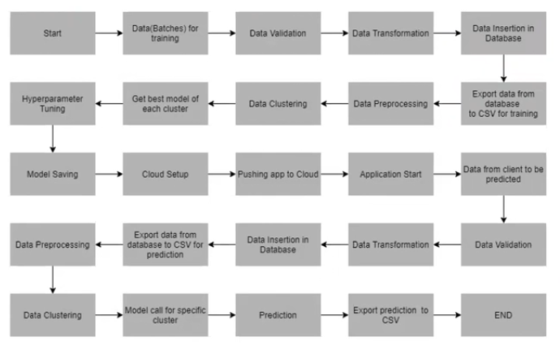
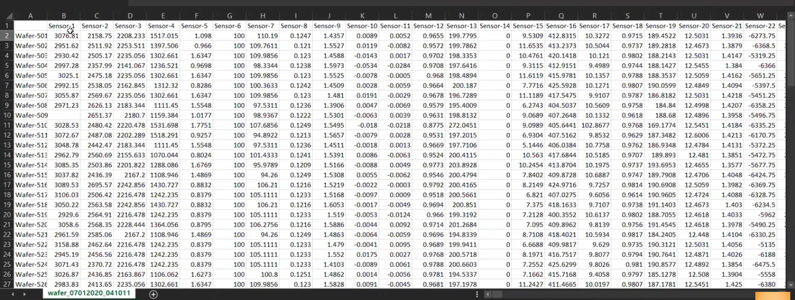
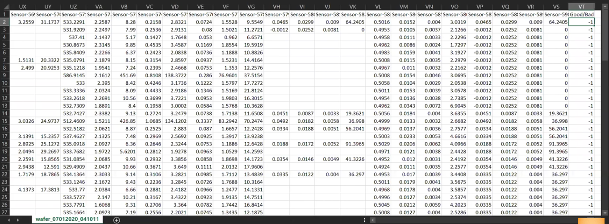

# SUBSTRATE FAULT DETECTION
A classification methodology made for Nirma University Labs to predict the quality of wafer sensors based on the given training data.

 <b>=> OBJECTIVE OF THE PROJECT</b>  
 + This project builds a classification methodology to predict the quality of substrate sensors based on the given training data. It helps in identifying the perticular substrate that is faulty so that it can be replaced without disturbing the whole production line. Based on the prediction the alarm placed by the client will notify and then the faulty substrate can be replaced by stopping that particular section of work. 
    
 <b>=> THE KEY PHASES</b>
   + Logging Framework
   + Data Ingestion 
   + Data Preprocessing 
   + Model Selection 
   + Model Tuning
   + Prediction
   + Deployment 
   + Model Retraning 

 <b>=> APPLICATION FLOW</b>
  
 

 <b>=> DATA :</b> 592 columns for training and 591 columns for prediction  
   
 

 <b>=> PROJECT FLOW</b>
   + <i>data validation</i> : good data and bad data files based on name of the file using regex and number of columns | validate column length | validate missing values in whole column 
   + <i>data transformation</i> : replace missing values with NULL 
   + <i>data insertion into database</i> : create training table | insert good data | archive bad data | convert to .csv 
   + <i>(data ingestion completed)</i>
   + <i>model training</i> : data preprocessing(check for missing values and imputation, checked for columns with std. dev. equals to zero and dropped) | clustering(k-means) | model selection(based on AUC Score) and hyperparameter tuning(get best parameters) 
   + <i>predictinos</i> : data validation | data tranformation | .csv generation | data preprocessing (check for missing values and imputation, checked for columns with std. dev. equals to zero and dropped) | find the the matching  cluster (k-means) | prediction from UI or postman
   + <i>deployment</i> 

 
 
 <b>=> PERFORMANCE MATRIX USED TO SELECT A MODEL BETWEEN XGBOOST AND RENDOM FOREST FOR THE CLUSTERS OBTAINED : AUC Score & Accuracy</b>
   + 3 clusters
   + 1st cluster : Random Forest model
   + 2nd cluster : Random Forest model
   + 3rd cluster : Random Forest model
 

 
  <b>=> HOW TO RUN THE PROJECT</b> 
      + Clone this repository 
      + Create a new environment conda create -n newenv python==3.6 
      + Open any IDE 
      + Install the requirements.txt file pip install -r requirements.txt 
      + After all the requirements are installed successfully Then run the app by python app.py 

linkedin : https://www.linkedin.com/in/hir-infinity/  
email : hirvamehta66@gmail.com 
